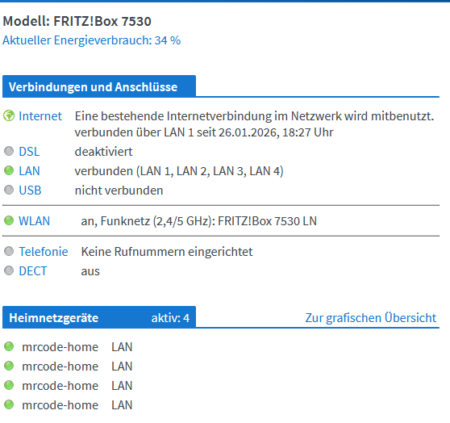
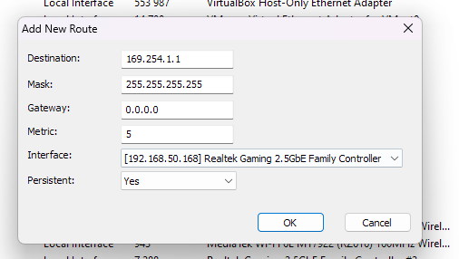

# Initial Setup
started by connecting all 4 lan cables from the fritzbox 7530 to my pc via 2.5gig ports
this revealted that the 4th lan port did not work so 3 times the nic and 1 port connected to the 2.5 gig motherboard connector.

## commands
### identify interfaces:
╰─ Get-NetAdapter | Where-Object {$_.LinkSpeed -eq "1 Gbps"} | Format-Table Name, InterfaceDescription, Status, LinkSpeed

Name                                       InterfaceDescription                       Status       LinkSpeed
----                                       --------------------                       ------       ---------
Ethernet 4                                 VirtualBox Host-Only Ethernet Adapter      Up           1 Gbps
Ethernet 5                                 Realtek Gaming 2.5GbE Family Controller    Up           1 Gbps
Ethernet 7                                 Realtek Gaming 2.5GbE Family Controller #3 Up           1 Gbps
Ethernet                                   Intel(R) Ethernet Controller (3) I225-V    Up           1 Gbps
OpenVPN Data Channel Offload for Surfshark OpenVPN Data Channel Offload               Disconnected 1 Gbps
Ethernet 6                                 Realtek Gaming 2.5GbE Family Controller #2 Up           1 Gbps

### remove existing stuff
Remove-NetIPAddress -InterfaceAlias "Ethernet 5" -Confirm:$false -ErrorAction SilentlyContinue
Remove-NetIPAddress -InterfaceAlias "Ethernet 7" -Confirm:$false -ErrorAction SilentlyContinue
Remove-NetIPAddress -InterfaceAlias "Ethernet" -Confirm:$false -ErrorAction SilentlyContinue
Remove-NetIPAddress -InterfaceAlias "Ethernet 6" -Confirm:$false -ErrorAction SilentlyContinue

### setup ip addresses for the fritzbox reachable address
New-NetIPAddress -InterfaceAlias "Ethernet 5" -IPAddress 169.254.1.3 -PrefixLength 16
New-NetIPAddress -InterfaceAlias "Ethernet 7" -IPAddress 169.254.1.4 -PrefixLength 16
New-NetIPAddress -InterfaceAlias "Ethernet" -IPAddress 169.254.1.5 -PrefixLength 16
New-NetIPAddress -InterfaceAlias "Ethernet 6" -IPAddress 169.254.1.6 -PrefixLength 16

### static routing (is this necessarly?)
New-NetRoute -DestinationPrefix "169.254.1.1/32" -InterfaceAlias "Ethernet 5" -NextHop "0.0.0.0" -RouteMetric 2
New-NetRoute -DestinationPrefix "169.254.1.1/32" -InterfaceAlias "Ethernet 7" -NextHop "0.0.0.0" -RouteMetric 3
New-NetRoute -DestinationPrefix "169.254.1.1/32" -InterfaceAlias "Ethernet" -NextHop "0.0.0.0" -RouteMetric 4
New-NetRoute -DestinationPrefix "169.254.1.1/32" -InterfaceAlias "Ethernet 6" -NextHop "0.0.0.0" -RouteMetric 5

### verify routing table (also via ping = works for all)
╰─ Get-NetRoute -DestinationPrefix "169.254.1.1/32" | Format-Table DestinationPrefix, NextHop, InterfaceAlias, RouteMetric

DestinationPrefix NextHop InterfaceAlias RouteMetric
----------------- ------- -------------- -----------
169.254.1.1/32    0.0.0.0 Ethernet 6               5
169.254.1.1/32    0.0.0.0 Ethernet                 4
169.254.1.1/32    0.0.0.0 Ethernet 7               3
169.254.1.1/32    0.0.0.0 Ethernet 5               2

# Idea
1. run 10 min pre warmup
2. run 20 min 1 port
3. run 20 min 2 ports
4. run 20 min 3 ports
5. run 20 min all 4 ports
6. post of 20 min

all ports run at full speed 

# Outcome prediction
will throtel quite a lot as the target is the router itself therefore cpu processing and not the switching hardware.

# Ideas for changed setup
use ourself as target for bidirectional traffic and only switching no cpu processing?

# Challanges
manually set each ethernet port to the correct ip address
otherwise the thing with increasing the poll frequency via the homeassistant hack!

Device A (Port 1) sending to Device B (Port 2) at 1 Gbps.
Device B (Port 2) sending to Device A (Port 1) at 1 Gbps.
Device C (Port 3) sending to Device D (Port 4) at 1 Gbps.
Device D (Port 4) sending to Device C (Port 3) at 1 Gbps.

But does this really make sense? Kind of yes as we can meassure power draw of the switching fabric but that is likelly super optimized so meassuring cpu might be more reallive scenario where traffic will flow outside the network as well e.g. video streaming, file download, etc. 

# all 4 connections to same device

# fix destination address?

output in csv:
